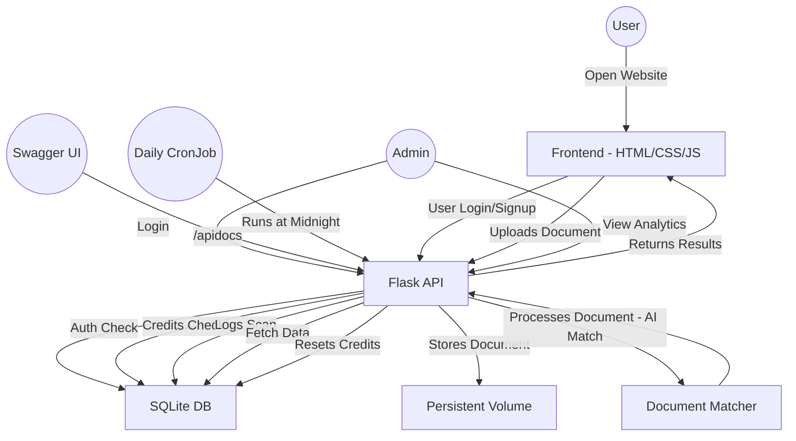

# DocScan
DocScan is a comprehensive full stack web application that Scans Documents for similarity with an inbuilt credit system.

## System Architecture:

**User Flow**

| Step | Description |
|---|---|
| **1** | User opens frontend in browser. |
| **2** | User logs in or registers. |
| **3** | User uploads document for scanning. |
| **4** | Frontend sends request to Flask backend. |
| **5** | Flask handles document storage, matching, and credit deduction. |
| **6** | Matched documents and results are sent back to frontend. |
| **7** | Admin can log in to view analytics and approve credit requests. |

## Architecture

**Deployment Approach**

The plan involves containerizing the application using Docker and orchestrating it with Kubernetes. A Helm chart defines the necessary resources:

- A Deployment for running the Flask-based service.
- A Service to expose the application within the cluster.
- A PersistentVolumeClaim (PVC) for storing the SQLite database and uploaded documents.
- A CronJob to reset user credits daily.
- After building and pushing the Docker image to a container registry, the Helm chart can be installed on a cluster (e.g., Minikube). The application becomes accessible through the configured service endpoint, and Swagger UI is available at /apidocs.

Credit reset functionality:
- A cronjob will be deployed as part of the helm chart
- Every day the job is triggered, resetting the credits (Deployment instructions given below)

How to deploy and test locally:
- Methode 1
  - Pre-requisites: python,pip installed locally
  - Clone the repo
  - Open terminal and cd into the repo
  - python -m venv venv
  - venv\Scripts\activate
  - pip install -r requirements.txt
  - python app.py
    
- Methode 2
  - Pre-requisites: Docker desktop installed
  - docker pull vishalvn2003492/docscan:v1
  - docker run -d -p 8080:80 vishalvn2003492/docscan:v1
  - open localhost:8080 in browser
 
- Methode 3
  - A kubernetes environment, like minikube or a kubernetes cluster
  - cd into docscanner in charts folder in repo
  - helm install doscanner . , given that the kuberneted env is accessible in cmd, powershell or equivalent
  - This deploys a service, to access docscan, cronjob for credit reset, the deployment itself
  - Port forward the service using kubectl command, kubectl port-forward service/document-scanner-service
  - Or use a ui like lens (openlens) and port forward, access the ui

Screenshots:

