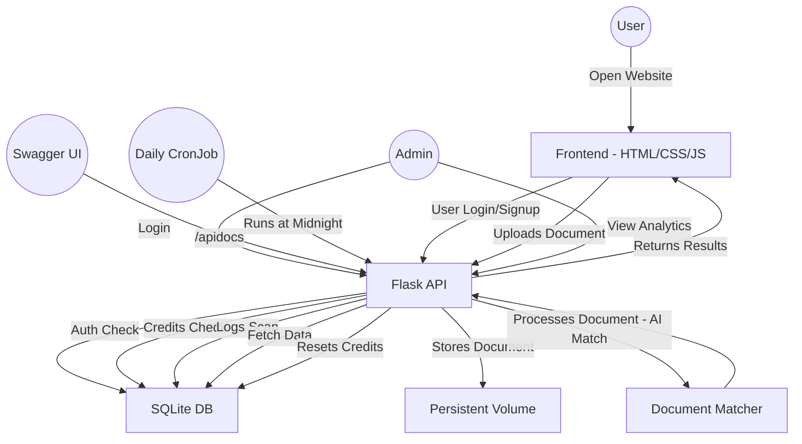

# ScanDoc
ScanDoc is a comprehensive full stack web application that Scans Documents for similarity with an inbuilt credit system.

## System Architecture:

**User Flow**

| Step | Description |
|---|---|
| **1** | User opens frontend in browser. |
| **2** | User logs in or registers. |
| **3** | User uploads document for scanning. |
| **4** | Frontend sends request to Flask backend. |
| **5** | Flask handles document storage, matching, and credit deduction. |
| **6** | Matched documents and results are sent back to frontend. |
| **7** | Admin can log in to view analytics and approve credit requests. |

## Architecture Flowchart

**Deployment Approach**

The plan involves containerizing the application using Docker and orchestrating it with Kubernetes. A Helm chart defines the necessary resources:
A Deployment for running the Flask-based service.
A Service to expose the application within the cluster.
A PersistentVolumeClaim (PVC) for storing the SQLite database and uploaded documents.
A CronJob to reset user credits daily.
After building and pushing the Docker image to a container registry, the Helm chart can be installed on a cluster (e.g., Minikube). The application becomes accessible through the configured service endpoint, and Swagger UI is available at /apidocs.
